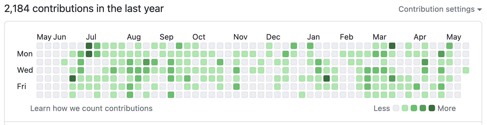
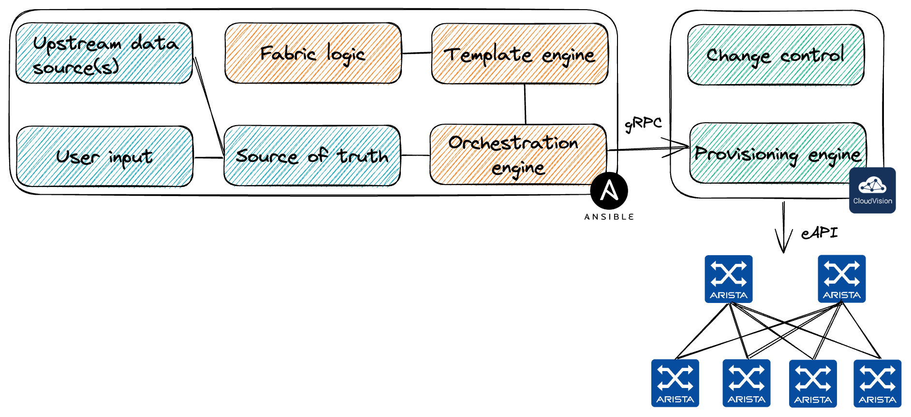

# Arista AVD

<style scoped>p {font-size: 28px;}</style>

How one Ansible collection ignited automation fusion power

<!-- Do not add page number on this slide -->
<!--
_paginate: false
-->

<!-- Add footer starting from this slide -->
<!--
footer: ''
-->


```python
__author__ = "Petr Ankudinov, Arista EMEA AS"

while True
    design()
    automate()
    validate()
    document()
```

```sh
$ date +"%b %Y"                 
Jun 2024
```

---

# $ whoami

<style scoped>section {font-size: 18px;}</style>

- Petr Ankudinov [github.com/ankudinov](https://github.com/ankudinov)

  - Advanced Services Engineer at Arista Networks
  - Over 20 years of experience in IT with a bit of everything
  - ACE: L5, CCIE 37521
  - Passionate DC and network automation engineer
  - Daily (and nightly) VSCode user

- David Meyer

  - Account Manager
  - to-be-defined





---

# Arista Networks

<style scoped>section {font-size: 24px;}</style>


- from IPO in 2014 to 800G AI platforms in 2024
- used by nearly every Cloud Titan
- top DC vendor crown since Q4 2023
- what helped us to grow
  - single EOS image
  - quality and testing
  - customer focus
  - merchant silicon
  - programmability with APIs from the start

<style scoped>p {font-size: 18px;}</style>

> Not every switch had API in 2014. Some still managed by CLI screen scraping in 2024.

---
# AI - Top Market of the Future

<div class="columns1">
<div>
<picture></picture>
</div>

---

# Ansible AVD

<style scoped>section {font-size: 20px;}</style>



- [AVD](https://avd.arista.com/) stands for Arista Validated Design as it was based on the [EVPN Deployment Guide](https://www.arista.com/custom_data/downloads/?f=/support/download/DesignGuides/EVPN_Deployment_Guide.pdf)
- A very successful community project used to deploy EVPN based Data Center fabrics
  - Around [250 stars on Github](https://github.com/aristanetworks/ansible-avd) and 101 contributors as of June 2024
  - The most active Arista collection on [Ansible Galaxy](https://galaxy.ansible.com/arista/avd)
- High level workflow:
  - Define abstracted group/host vars using AVD data model
  - Generate low level device specific variables (aka structured configs)
  - Parse templates, build plain text configs
  - Deliver configs to network devices using Ansible `arista.eos.eos_config` or CVP module

---

# Demo

<style scoped>section {font-size: 20px;}</style>


- to-be-defined

---

<style scoped>section {font-size: 45px;}</style>


# Q&A

- [Ansible AVD](https://avd.arista.com/)
