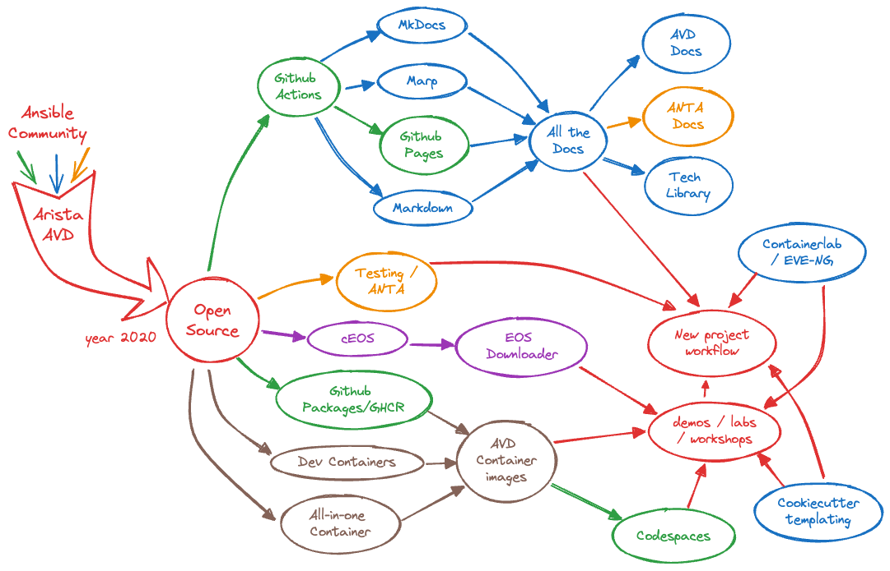

# Arista AVD

<style scoped>p {font-size: 28px;}</style>

How one Ansible collection ignited automation fusion power

<!-- Do not add page number on this slide -->
<!--
_paginate: false
-->

<!-- Add footer starting from this slide -->
<!--
footer: ''
-->


```python
__author__ = "Petr Ankudinov, Arista EMEA AS"

while True
    design()
    automate()
    validate()
    document()
```

```sh
$ date +"%b %Y"                 
Jun 2024
```

---

# $ whoami

<style scoped>section {font-size: 18px;}</style>

- Petr Ankudinov [github.com/ankudinov](https://github.com/ankudinov)

  - Advanced Services Engineer at Arista Networks
  - Over 20 years of experience in IT with a bit of everything
  - ACE: L5, CCIE 37521
  - Passionate DC and network automation engineer
  - Daily (and nightly) VSCode user

- David Meyer

  - Account Manager
  - to-be-defined


---

# Arista Networks

<style scoped>section {font-size: 24px;}</style>


- from IPO in 2014 to 800G AI platforms in 2024
- used by nearly every Cloud Titan
- top DC vendor crown since Q4 2023
- what helped us to grow
  - single EOS image
  - quality and testing
  - customer focus
  - merchant silicon
  - programmability with APIs from the start

<style scoped>p {font-size: 18px;}</style>

> Not every switch had API in 2014. Some still managed by CLI screen scraping in 2024.

---

# AI - Top Market of the Future

/Images%20(Marketing%20Only)/Blog/JU-Blog-AI-Center.png?width=970&height=467&name=JU-Blog-AI-Center.png)

---

# Arista AVD Ansible Collection

<style scoped>section {font-size: 18px;}</style>


- [AVD](https://avd.arista.com/) stands for Arista Validated Design as it was based on the [EVPN Deployment Guide](https://www.arista.com/custom_data/downloads/?f=/support/download/DesignGuides/EVPN_Deployment_Guide.pdf)
- A very successful community project used to deploy EVPN based Data Center fabrics
  - Ansible certified since November 2020
  - Around [250 stars on Github](https://github.com/aristanetworks/ansible-avd) and 101 contributors as of June 2024
  - The most active Arista collection on [Ansible Galaxy](https://galaxy.ansible.com/arista/avd)
- High level workflow:
  - Define abstracted group/host vars using AVD data model
  - Generate low level device specific variables (aka structured configs)
  - Parse templates, build plain text configs
  - Deliver configs to network devices using Ansible `arista.eos.eos_config` or CVP module

---

# AVD Impact

<style scoped>section {font-size: 18px;}</style>

<div class="columns">
<div>

## Before

Can automate, but crawling... 🐌

- Write HLD
- Write LLD
- Build configuration tempates
- Build a workshop materials and lab
- write some custom scripts

> All for one project. No standard, hard to share.

</div>
<div>

## After

Automate and walk! 🚶

- Set of standard design templates
- Design as a repository
- Test in a virtual / container lab
- Fix and deploy in prod
- Interactive workshops as a repository

> Easy to share and re-use. Helps to buld more useful content and tools.

</div>
</div>

---

# Ansible Brings Community Power



<style scoped>section {font-size: 18px;}</style>

automation fusion @Arista:

- Do the right thing!
  (©️ Arista Way)
- use it for your daily work
- build as a community
- everyone can contribute
- What next?
  - Running? 🏃
  - Flying? 🚀

---

# A Small Example Of Ecosytem Changing the Game Rules

<style scoped>section {font-size: 18px;}</style>

* We all love Ansible `-vvvvvvvvvvvviii!...` 😄
* A life changing trick:

  - have a container
  - open and run the playbook in VSCode
  - `Cmd + Click` (Mac users) on a cryptic error message
    
  - Change your code
    
  - Get a meaningful error message

```text
error='rpc error: code = PermissionDenied desc = user cannot write tag assignments they do not own'
```

---

# Arista Open CI


---

# Customer Intro Placeholder

slide to be created

---

# It All Started with A Single vEOS-lab VM

<style scoped>section {font-size: 18px;}</style>

- Before any hardware got delivered on site we made extensive use of vEOS-LAB
  - ~90% feature complete version of EOS
  - runs on several industry standard hypervisors

- Scale up - develop the entire automation chain from `git commit` to a CloudVision task

- Moving from four deployed vEOS-lab VMs to EVE-NG as simulation platform
  - multi-node cluster (AMD EPYC 7763 64-Core, 512GB RAM per node)
  - over 100 vEOS instances forming multiple EVPN fabrics or single MLAG pairs
  - simulate firewall crossings using vEOS or VyOS

---

# Customer Gitlab CI Placeholder

slide to be created

---

# Demo

<style scoped>section {font-size: 20px;}</style>


- to-be-defined

---

<style scoped>section {font-size: 45px;}</style>


# Q&A

- [Ansible AVD](https://avd.arista.com/)


