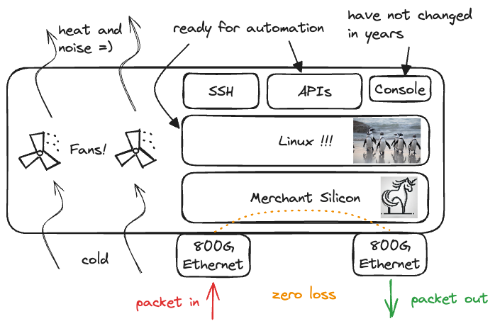

# Arista AVD

<style scoped>p {font-size: 28px;}</style>

How one Ansible collection ignited automation fusion power

<!-- Do not add page number on this slide -->
<!--
_paginate: false
-->

<!-- Add footer starting from this slide -->
<!--
footer: ''
-->


```python
__author__ = "Petr Ankudinov, Arista EMEA AS"

while True
    design()
    automate()
    validate()
    document()
```

```sh
$ date +"%b %Y"                 
Jun 2024
```

---

# $ whoami

<style scoped>section {font-size: 16px;}</style>
<style scoped>p {font-size: 22px;}</style>

- Petr Ankudinov [github.com/ankudinov](https://github.com/ankudinov)

  - Advanced Services Engineer at Arista Networks
  - Over 20 years of experience in IT with a bit of everything
  - ACE: L5, CCIE 37521
  - Passionate DC and network automation engineer
  - Daily (and nightly) VSCode user

- David Meyer

  - Account Manager
  - to-be-defined

- Kaspar Huber

  - Network Engineer at R&S for 2 years
  - Studied informatics at University of Applied Sciences, Munich
  - Enjoy `tinkering around` during free time.


---

# Arista Networks

<style scoped>section {font-size: 22px;}</style>


- founded 2004, IPO 2014
- 100 Million Ethernet ports and 800G AI platforms
- used by nearly every Cloud Titan
- № 1 vendor for DC networking since Q4 2023
- what helped us to grow
  - single EOS image
  - quality and testing
  - customer focus
  - merchant silicon
  - programmability with APIs from the start

<style scoped>p {font-size: 18px;}</style>

---

# What is a Switch?



<style scoped>section {font-size: 20px;}</style>
<style scoped>p {font-size: 20px;}</style>

- **Short**: A Linux box that handles a lot of PPS (packets-per-second)
- Linux should be easy to automate. However...
  - `arista.eos.eos_banner`, `arista.eos.eos_hostname`, `arista.eos.eos_user`, `arista.eos.eos_vlans`, `arista.eos.eos_command`, `arista.eos.eos_acl`, etc.
  - add/update/remove... maintain
  - Can we go back to CLI? ⌨️
- **Result**: Hand crafted configs with errors, CLI screen scraping, etc.

> **A Very Sad Fact**: CLI screen scraping exists in 2024. Fortunately not in Arista world.

---

# Arista AVD Ansible Collection

<style scoped>section {font-size: 22px;}</style>


- [AVD](https://avd.arista.com/) stands for Arista Validated Design as it was based on the [EVPN Deployment Guide](https://www.arista.com/custom_data/downloads/?f=/support/download/DesignGuides/EVPN_Deployment_Guide.pdf)
- A very successful community project used to deploy EVPN based Data Center fabrics
  - Ansible certified since November 2020
  - Around [250 stars on Github](https://github.com/aristanetworks/ansible-avd) and 101 contributors as of June 2024
  - The most active Arista collection on [Ansible Galaxy](https://galaxy.ansible.com/arista/avd)

---

# How AVD Works


<style scoped>section {font-size: 14px;}</style>

- Works well with Ansible CE or Ansible AAP
- Enviroments: custom, [AVD container images](https://avd.arista.com/4.7/docs/containers/overview.html), [Ansible EEs](https://ansible.readthedocs.io/en/latest/getting_started_ee/index.html)
- Roles:
  - `arista.avd.eos_designs`
    - a set of modules to produce low level variables from abstracted input data using sophisticated fabric logic
  - `arista.avd.cli_config_gen`
    - generate Arista EOS cli configuration from a set of templates and variables produced by `eos_designs` role
  - `arista.avd.cv_deploy` or `arista.avd.eos_config_deploy_eapi`
    - deploy configurations
  - `arista.avd.eos_validate_state`
    - validate operational state of Arista EOS devices (with ANTA)
- High level workflow:
  - Define abstracted group/host vars using AVD data model
  - Generate low level device specific variables (aka structured configs)
  - Parse templates, build plain text configs
  - Deliver configs to network devices using Ansible `arista.eos.eos_config` or CVP module

---

# AVD Impact

<style scoped>section {font-size: 18px;}</style>

<div class="columns">
<div>

## Before

Can automate, but crawling... 🐌

- Write HLD
- Write LLD
- Build configuration tempates
- Build a workshop materials and lab
- write some custom scripts

> All for one project. No standard, hard to share.

</div>
<div>

## After

Automate and walk! 🚶

- Set of standard design templates
- Design as a repository
- Test in a virtual / container lab
- Fix and deploy in prod
- Interactive workshops as a repository

> Easy to share and re-use. Helps to buld more useful content and tools.

</div>
</div>

---

# Ansible Brings Community Power


<style scoped>section {font-size: 20px;}</style>
<style scoped>p {font-size: 20px;}</style>

automation fusion @Arista:

- Do the right thing!
  (©️ Arista Way)
- use it for your daily work
- build as a community
- everyone can contribute
- What next?
  - Running? 🏃
  - Flying? 🚀

---

# A Small Example Of Ecosytem Changing the Game Rules

<style scoped>section {font-size: 22px;}</style>
<style scoped>p {font-size: 22px;}</style>


- We all love Ansible `-vvv` 😄
- A life changing trick:

  - have a container
  - open and run the playbook in VSCode
  - `Cmd + Click` (Mac users) on a cryptic error message
    
  - Change your code
    
  - Get a meaningful error message

    ```text
    error='rpc error: code = PermissionDenied desc = user cannot write tag assignments they do not own'
    ```

---

# Arista Open CI


---

# Rohde & Schwarz: One Company, Three Divisions, Diverse Markets. Reliable Technology Partner

<style scoped>section {font-size: 26px;}</style>


---

# It All Started with A Single vEOS-lab VM

<style scoped>section {font-size: 24px;}</style>
<style scoped>p {font-size: 20px;}</style>

- Before any hardware got delivered on site we made extensive use of vEOS-LAB
  - ~90% feature complete version of EOS
  - runs on several industry standard hypervisors

- Scale up - develop the entire automation chain from `git commit` to a CloudVision task

- Moving from four deployed vEOS-lab VMs to EVE-NG as simulation platform
  - multi-node cluster (AMD EPYC 7763 64-Core, 512GB RAM per node)
  - over 100 vEOS instances forming multiple EVPN fabrics or single MLAG pairs
  - simulate firewall crossings using vEOS or VyOS

---

# Gitlab Pipeline With Arista Open CI

<style scoped>section {font-size: 18px;}</style>
<style scoped>p {font-size: 16px;}</style>
<style scoped>li {font-size: 16px;}</style>

- Commit to the Git repository
  - trigger GitLab CI/CD pipeline (only relevant systems are rendered)
  - inform team members via chat service

   

- Manual runs trigger the pipeline for all subprojects

    

---

# Demo &nbsp;&nbsp;&nbsp;&nbsp;&nbsp;&nbsp;&nbsp;&nbsp;&nbsp;&nbsp;&nbsp;&nbsp;&nbsp;&nbsp;&nbsp;&nbsp;&nbsp;&nbsp;&nbsp;&nbsp;&nbsp;&nbsp;&nbsp;&nbsp;&nbsp;&nbsp;&nbsp;&nbsp;&nbsp;&nbsp;&nbsp;&nbsp;&nbsp;&nbsp;&nbsp;&nbsp;&nbsp;&nbsp;&nbsp;&nbsp;&nbsp;&nbsp;&nbsp;&nbsp;&nbsp;&nbsp;&nbsp;&nbsp;&nbsp;&nbsp;&nbsp;&nbsp;&nbsp;&nbsp;&nbsp;&nbsp;&nbsp;&nbsp;[(Click here to access the demo)](https://arista-netdevops-community.github.io/one-click-se-demos/cvaas-cvaas-and-avd-demo--evpn-mlag/cvaas-cvaas-and-avd-demo--evpn-mlag/)

<style scoped>section {font-size: 20px;}</style>


<!--  -->
<iframe width="840" height="472" src="https://www.youtube.com/embed/1J6LbFpt_Qs?si=5PVplVjcG12aMpZV" title="Short AVD Demo" frameborder="0" allow="accelerometer; autoplay; clipboard-write; encrypted-media; gyroscope; picture-in-picture; web-share" referrerpolicy="strict-origin-when-cross-origin" allowfullscreen></iframe>

---

<style scoped>section {font-size: 40px;}</style>


# Q&A

- [Ansible AVD](https://avd.arista.com/)
- [Demo](https://arista-netdevops-community.github.io/one-click-se-demos/cvaas-cvaas-and-avd-demo--evpn-mlag/cvaas-cvaas-and-avd-demo--evpn-mlag/)


---

# References


- Slides

  - [Marp](https://marp.app/)

- Images:

  - [Pexel](https://www.pexels.com/)
  - [DALL-E](https://openai.com/index/dall-e-3/)
  - [Excalidraw](https://github.com/excalidraw/excalidraw)
